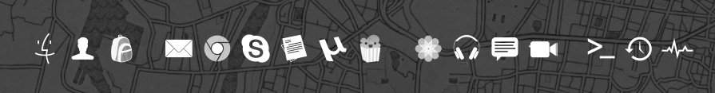
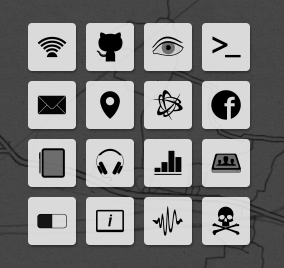
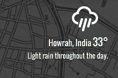
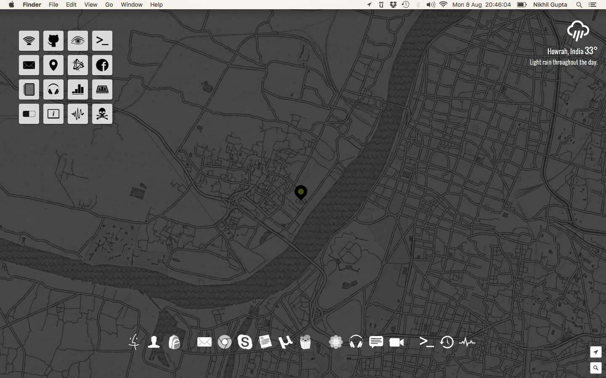

# Ubersicht Widgets

Note that, I use =CTRL= key as the modifier, as that allows me to even enter
input inside my widgets. Yes, its a bit cumbersome to enter input into widgets,
but atleast the functionality is there when I need it. This is specially useful
with the Mapbox widget, where I can enter the name of a location and get the
Mapbox widget to display the map for that area.

## Install

  - Clone this repository.

        git clone https://github.com/nikhgupta/ubersicht.git ~/ubersicht

  - Install `npm` modules inside `./widgets` directory.

        cd ~/ubersicht/widgets
        npm install

  - Set `./widgets` directory as Ubersicht location.

## Included Plugins

  - FontAwesome (via Bower)
  - Toastr (via Bower - for notifications)

## Dock Widget

An OSX dock that opens various applications for the user. Typically, the dock
can, also, run any programs or scripts, but the Dock widget in itself is,
particularly, reserved for opening applications in my setup.

## Grid Widget

A grid of icons on the desktop that can open any application, run some script,
or do anything else I want with a sheer click. Some of the scripts include:

- Displaying External and Internal IP address along with Proxy being used.
- Toggle other Ubersicht widgets
- Display realtime output from a terminal command on the Desktop
- Open a playlist in iTunes
- Show statistics about something in a neat graph format on the Desktop
- Lock screen, and so on.

## Weather Widget

Displays weather for the user's detected location (or a default one).

## Mapbox Widget

Probably, the best widget in this arsenal. This widget displays map for the
user's detected location in the background as a full-size wallpaper.
The map can be interacted with, as well as has several customization options
available in it.

## Remaining Tasks/Ideas

- Jio Usage details
- Work related metrics from several sources
- sidekiq stats
